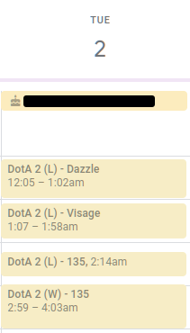
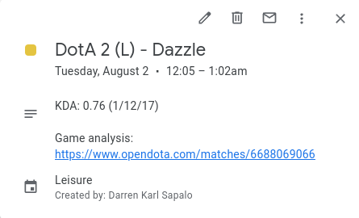
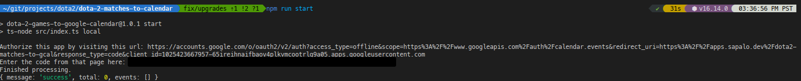

# Save your Dota 2 games to your Google Calendar
> I know I have an addiction, I just want to know how bad it is.

[](https://travis-ci.org/darrensapalo/dota-2-matches-to-calendar)

REST API-triggered web application that copies your DotA 2 games (from OpenDota API) into Google Calendar events.

#### 🚀 Automatically creates Google Calendar events of your DotA 2 games


*Figure 1: Google Calendar events are automatically created from your DotA 2 games.*

#### 📑 Includes game summary on the event description


*Figure 2: Google Calendar event provides KDA and a link to the opendota game analysis.*


# Installation

1. Clone the application.

```bash
git clone https://github.com/darrensapalo/dota-2-matches-to-calendar
```

2. Install the dependencies.

```bash
npm install
```

3. Start the application.

```bash
npm run start
```

4. After running the project for the first time, it will give you a URL to access, which you need to visit.



5. This page requests permissions on your Google account to create calendar events in your behalf.

6. Return to the terminal with your key.

8. It will begin to enter your latest games as calendar events.

# Roadmap

* Design a user experience wherein the user can register to have their dota games uploaded as Google Calendar events.
* Parameterize how many games to record (e.g. Create at most the 5 latest DotA games that don't exist yet).

## Usage
*⚠️ Ideal usage; not the actual current usage*

Ideal

# References

## Libraries

1. [OpenDota API][open-dota-api] for fetching dota games.
2. [Google Calendar API for Node.js][gcal-node] for inserting calendar events.
3. [RxJS](https://github.com/ReactiveX/rxjs) for handling streams of data.
4. [Day.js](https://day.js.org/) for handling time related data.

# Copyright

MIT [License](./LICENSE.txt).

# Author

Reach me on the following platforms:

- Personal blog at [sapalo.dev](https://sapalo.dev).

- Thoughts on my [Twitter](https://twitter.com/darrensapalo).

- Some other pieces of code at [GitLab](https://gitlab.com/darrensapalo).


## Credits

Hero list retrieved from [Glebsky/dota2-api][glebsky-dota-api] a fork of [kronusme/dota2-api][kronusme-dota-api].

<!-- References -->
[glebsky-dota-api]: https://github.com/Glebsky/dota2-api/blob/feature/data/heroes.json
[kronusme-dota-api]: https://github.com/kronusme/dota2-api/blob/master/data/heroes.json
[open-dota-api]: https://docs.opendota.com/#section/Introduction
[gcal-node]: https://developers.google.com/calendar/quickstart/nodejs
